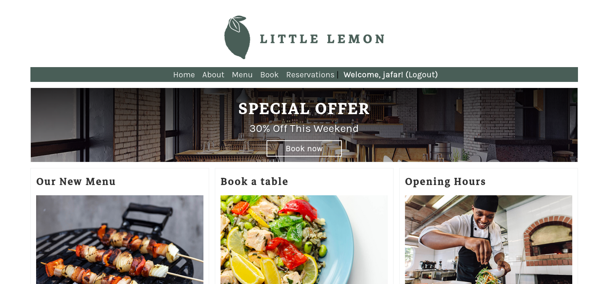

# 🍋 Little Lemon Restaurant – Final Project (Meta Back-End Developer Course)

This is my submission for the final assignment of the **Meta Back-End Developer Professional Certificate**.

## 📚 About the Course

Throughout the course, we learned to build modern web backend using:

- **Django** – for powerful and scalable web application development
- **Django REST Framework (DRF)** – for building RESTful APIs
- **Djoser** – for handling authentication endpoints out of the box (login, signup, password reset, etc.)

The course covered concepts like:
- Models and migrations
- Viewsets, serializers, permissions
- Token-based authentication
- API testing and integration with tools like **Insomnia** and **Postman**
- Connecting to **MySQL databases**

---

## 🍽️ Project Overview: Little Lemon Restaurant

This is a fictitious Mediterranean restaurant located in **Chicago**.

### 🌟 Key Features:
🔹 **User Registration & Login** (via Djoser & token auth)
🔹 **Menu** with categorized dishes:
  - Italian
  - Greek
  - Turkish
🔹 **Booking System**: Make table reservations by date and time
🔹 **Role-based Access**:
  - Admins manage users
  - Managers manage staff and orders
  - Delivery crew update delivery status
🔹 **MySQL Database Integration**
🔹 **Admin Panel** for managing menu items, orders, categories, and staff groups

---

## 📷 Screenshot

